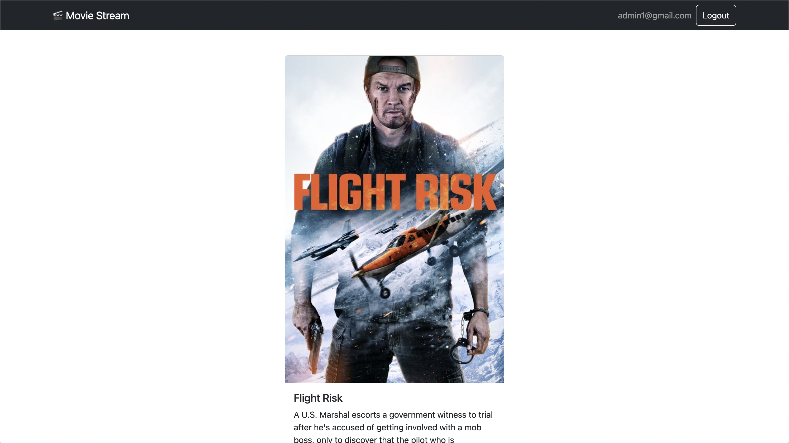
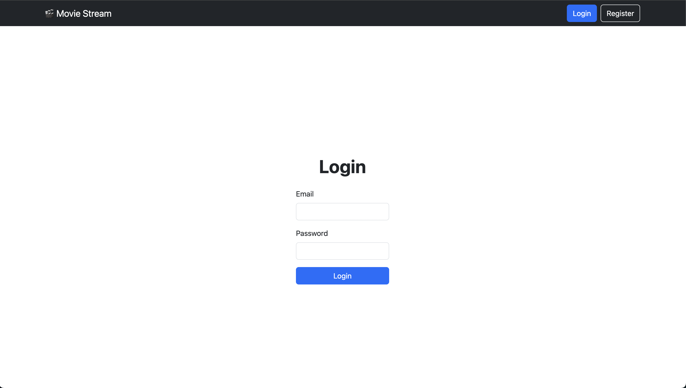

🎬 Movie App

🚀 Deployment
This project is deployed on Netlify:
🔗 [Live Demo](https://movie-app-restuarmando.netlify.app/)


A simple movie listing application that fetches data from the **TMDB API**, allows users to **search movies**, view **movie details**, and includes a **basic authentication system** (login, register, logout).

## 🚀 Features

✅ Fetch and display popular movies from TMDB API  
✅ Search for movies by title  
✅ View detailed movie information  
✅ User authentication (Register, Login, Logout)  
✅ Responsive design with Bootstrap  
✅ Pagination for movie list  
✅ Error handling for API failures

## 🖼 Screenshots

| Movie List | Movie Detail |
|------------|-------------|
|  |  |

| Login Page | Profile Page |
|------------|-------------|
|  |  |


## 🛠 Tech Stack

- **ReactJS + Vite** (Frontend framework)
- **Bootstrap** (UI Styling)
- **React Router** (Navigation)
- **LocalStorage** (Authentication state)
- **TMDB API** (Movie Data Source)

## 🏗 Installation & Setup

1️⃣ Clone the repository:

```sh
git clone (https://github.com/Restu-Armando/Movie-Web.git)
cd Movie-Web
npm install
```

## Set up environment variables:

Create a .env file in the root folder
Copy and modify from .env.example:

```sh
VITE_TMDB_API_KEY=your_api_key_here
VITE_TMDB_BASE_URL=https://api.themoviedb.org/3
```

## Run the project

```sh
npm run dev
```

## 📌 Notes

This project is built for a coding assessment under Talent Growth.
Authentication is handled via LocalStorage, so it's not secure for production use.

## 📝 License

This project is for educational purposes only.
